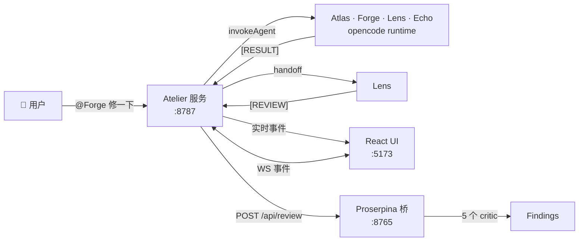

# Atelier

> 多 Agent 协作聊天室 —— 与 AI 专家(Atlas · Forge · Lens · Echo)同处一室,流式看到每一步,产出决策而非闲聊。

Atelier 把 **Fastify + WebSocket** 后端 和 **React 19 + Vite + Tailwind v4** 前端 与可选的 **Proserpina 评审桥**(Python / FastAPI)串成一套系统。Agent 之间通过 `@` 提及 或 隐式 `[RESULT]` / `[REVIEW]` 标签 自动交接;每一步都通过 28 个事件的 WS 协议 实时广播,前端就能渲染 Live Activity、结构化 diff 卡片、review lane,而不是一团黑盒对话。



---

## ✨ 特性

- **多 Agent 房间** —— 每个房间一个 agent 团队,`@Atlas`、`@Forge` 等把消息精确路由到对应专家。
- **隐式交接** —— Forge 抛出 `[RESULT]` 自动召唤 Lens 评审;若 Lens 标 `critical`/`major`,再把 Forge 拉回来返工。
- **防刷防深** —— 内置频次/深度保护(10 条内 5 条同 agent / 链深 50)防止失控循环。
- **Live Activity 流** —— agent 的 `thinking` / `tool_call` / `handoff` / `completed` / `error` 在右侧时间线实时展示。
- **结构化信号卡片** —— `[RESULT]` 出 diff 卡片,`[REVIEW]` 出严重度 lane 加 accept/reject,`[QUESTION]` 出内联回复框,`[DECISION]` / `[BLOCKER]` / `[TODO]` 各自专属形态。
- **Proserpina 评审桥** —— 可对任意 agent 输出调用 5 个 Python critic(Methodologist / Devil's Advocate / Editor / Domain Expert / Red Team)。
- **Cmd-K 命令栏** —— Linear 风调色板:跳房间、建房间、切换 Review / Self-Talk / 右栏。
- **流式 + 跳到底** —— Virtuoso 虚拟消息列表,带 stop 按钮、思考时的 pulse 头像、上滑时出现的"新消息"浮钮。
- **一条命令启动** —— `atelier start` 起 server / frontend / bridge 三件套,带健康探测轮询。

---

## 🚀 快速开始

### 前置
- Node 20+
- Python 3.11+(只 Proserpina 评审桥需要)
- Windows / macOS / Linux

### 安装
```bash
git clone https://github.com/Cappuccino-y/Atelier.git
cd Atelier

# 前端
npm install

# 后端
cd server && npm install && cd ..

# 评审桥(可选但推荐)
cd proserpina-bridge && python -m venv .venv && source .venv/bin/activate && pip install -r requirements.txt && cd ..
```

### 启动
```bash
# 把 D:\Atelier\scripts 加到 PATH(仅 Windows)
# 然后在任何目录下:
atelier start
```

会拉起三个后台进程:

| 服务         | 端口 | URL                          |
|--------------|------|------------------------------|
| Server       | 8787 | http://127.0.0.1:8787        |
| Frontend     | 5173 | http://127.0.0.1:5173        |
| Proserpina   | 8765 | http://127.0.0.1:8765/health |

日志在 `logs/{server,frontend,proserpina}.log`。

### 停止 / 管理
```bash
atelier stop            # 杀三端口
atelier restart         # 先停再启
atelier status          # 看上次状态
atelier logs server     # tail server 日志
```

---

## 📁 项目结构

```
Atelier/
├── project.md                    # 原始需求(zh)
├── package.json                  # 前端(Vite + React 19 + Tailwind v4)
├── index.html
├── src/
│   ├── App.tsx                   # 状态 + WS 事件路由
│   ├── main.tsx
│   ├── index.css                 # 设计 token、prose-chat、agent-pulse 动画
│   ├── components/
│   │   ├── chat/                 # MessageList · MessageItem · Composer · RoomHeader
│   │   ├── layout/               # AppShell · TopBar · Sidebar · RightPanel · CommandBar
│   │   ├── ui/                   # shadcn/ui 原语
│   │   └── *Dialog.tsx
│   ├── lib/                      # api · ws · utils · atch-debug
│   └── types/                    # 共享 TS 类型(Agent、Message、Room、ActivityEvent...)
├── server/
│   ├── package.json              # Fastify + better-sqlite3 + tsx
│   ├── .env                      # AGENT_RUNTIME、OPENCODE_MODEL
│   └── src/
│       ├── index.ts              # Fastify 入口、10 路由、/ws
│       ├── db.ts                 # SQLite 建表 + 种子数据
│       ├── broadcast.ts          # WebSocket 广播
│       ├── config.ts
│       ├── agents/
│       │   ├── runtime.ts        # opencode CLI / mock 适配器
│       │   ├── process-agent.ts  # 单 agent 调度封装
│       │   ├── triggers.ts       # @提及 + 隐式 [RESULT]/[REVIEW] 交接、频次/深度保护
│       │   ├── arbiter.ts
│       │   └── prompts.ts
│       └── routes/               # agents · debug · events · mcp · messages · review · rooms · routing · runtime · tasks
├── proserpina-bridge/
│   ├── main.py                   # FastAPI :8765
│   ├── critics/                  # 5 critic:base · methodologist · devils_advocate · editor · domain_expert · red_team
│   └── requirements.txt
├── scripts/
│   ├── atelier.bat               # 3 行包装(cmd → atelier.ps1 %*)
│   └── atelier.ps1               # PowerShell 控制器(杀→等→起→探)
└── logs/                         # 运行日志(gitignore)
```

---

## ⚙️ 配置

### 前端 `.env.development`
```bash
VITE_API_URL=http://127.0.0.1:8787
VITE_WS_URL=ws://127.0.0.1:8787/ws
```

### 后端 `server/.env`
```bash
AGENT_RUNTIME=mock          # "mock" 或 "opencode"
OPENCODE_MODEL=minimax2/MiniMax-M3    # 你 opencode 配置里的 model key
PORT=8787
HOST=127.0.0.1
```

### 评审桥 `proserpina-bridge/.env`(可选)
```bash
PORT=8765
PANEL=default               # default · duo · panel
```

---

## 🧠 Agent 体系

四个注册的专家在 `~/.config/opencode/` 里:

| Agent  | 角色         | 触发                  |
|--------|--------------|-----------------------|
| Atlas  | 调度         | `@Atlas`              |
| Forge  | 实现         | `@Forge`              |
| Lens   | 评审         | `@Lens` 或 `[RESULT]` 后自动 |
| Echo   | 支援         | `@Echo`               |

推进对话有两种方式:

1. **显式提及** —— `Hey @Forge,把 triggers.ts 改成 better-sqlite3 事务`
2. **隐式交接** —— agent 输出 `[RESULT]` 时,Lens 自动被召唤做评审;若 Lens 命中 `critical` / `major`,Forge 再被召唤返工。

被识别为一等 UI 形态的标签:
```
[DECISION]  [TODO]  [STATUS]  [RESULT]  [REVIEW]  [QUESTION]  [BLOCKER]
```

---

## 🔌 HTTP 与 WebSocket API(节选)

REST:
```
GET    /api/rooms
POST   /api/rooms
GET    /api/rooms/:id
PATCH  /api/rooms/:id
DELETE /api/rooms/:id
POST   /api/rooms/:id/clear
GET    /api/rooms/:id/messages
POST   /api/rooms/:id/messages
GET    /api/rooms/:id/tasks
POST   /api/rooms/:id/tasks
GET    /api/rooms/:id/events
GET    /api/agents
POST   /api/agents
PATCH  /api/agents/:id/status
POST   /api/review          # → proserpina 桥
POST   /api/route-to        # 直接调度 agent
POST   /api/invite          # 加 agent 进房间
POST   /api/self-talk       # 切换 self-talk tick
GET    /api/runtime/status
```

WebSocket 事件(共 28 个,server → client):
```
message.created · task.created · task.updated · task.deleted
room.created · room.updated · room.deleted · messages.cleared
project.updated · agent.created · agent.updated · agent.status
agent.thinking · agent.tool_call · agent.handoff
agent.completed · agent.error · activity.cleared
self_talk.start · self_talk.stop · self_talk.tick
escalation · rework · finding.accepted · finding.rejected
review.completed · routing.route · routing.invite
system.warning · system.info · system.error · ping · pong
```

---

## 🛠 开发

```bash
# Server(用 tsx,无 watch — 手动重启最快)
cd server && npm run dev

# 带 HMR 的 server(Windows 上慢,推荐手动重启)
cd server && npm run dev:watch

# 前端(Vite HMR)
npm run dev          # vite
npm run build        # 生产构建
npm run preview      # 预览产线产物
npm run typecheck    # tsc --noEmit

# 评审桥
cd proserpina-bridge && uvicorn main:app --reload --port 8765
```

---

## 🔭 路线图

- [ ] LLM token 流式推到 WS(目前 agent 回复是一次性返回)
- [ ] SQLite → Postgres 迁移工具
- [ ] Agent 记忆:跨重启的 per-room 上下文窗口
- [ ] 多租户:单 server 多 workspace
- [ ] `[RESULT]` 卡片内嵌 diff 视图(左右并排)
- [ ] Proserpina 的 Web UI,可按 workspace 调 critic 权重

---

## 📄 许可

MIT —— 见 `LICENSE`(若尚未添加请补一份)。
