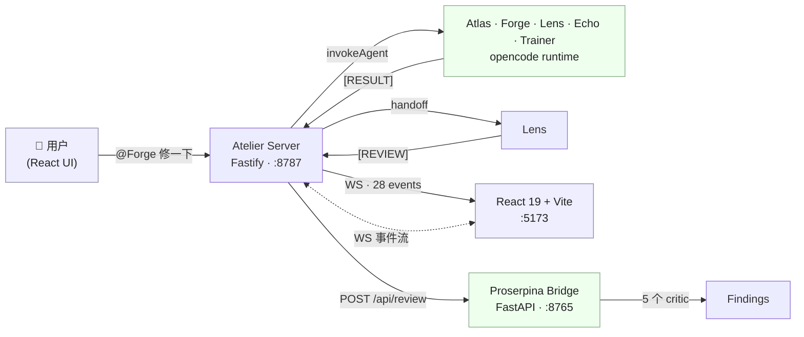

<div align="center">

# 🎨 Atelier

**多 Agent 协作聊天室 —— 与 AI 专家（Atlas · Forge · Lens · Echo）同处一室，**
**流式看到每一步，产出决策而非闲聊。**

<br>

[](LICENSE)
[](https://nodejs.org)
[](https://www.typescriptlang.org)
[](https://react.dev)
[](https://vitejs.dev)
[](https://fastify.dev)
[](https://python.org)
[](https://github.com/opencode-ai/opencode)

<br>

[快速开始](#-快速开始) · [Per-Agent 模型配置](#-per-agent-模型配置) · [项目结构](#-项目结构) · [API 参考](#-api-参考) · [路线图](#-路线图)

<br>

</div>

---

## ✨ 核心特性

| 能力 | 说明 |
|---|---|
| 🧩 **多 Agent 房间** | 每个房间一套 agent 团队，`@Atlas` / `@Forge` / `@Lens` / `@Echo` 把消息精确路由到对应专家。 |
| 🔁 **隐式交接** | Forge 抛出 `[RESULT]` 自动召唤 Lens 评审；命中 `critical` / `major` 再把 Forge 拉回来返工。 |
| 🛡️ **防刷防深** | 内置频次 / 深度保护（10 条内同 agent ≤ 5 次 / 链深 ≤ 50）防止失控循环。 |
| 📡 **Live Activity 流** | `thinking` / `tool_call` / `handoff` / `completed` / `error` 实时右侧时间线呈现。 |
| 🏷️ **结构化信号卡片** | `[RESULT]` 出 diff、`[REVIEW]` 出严重度 lane + accept/reject、`[QUESTION]` 出内联回复框；`[DECISION]` / `[BLOCKER]` / `[TODO]` 各自专属形态。 |
| 🦾 **Proserpina 评审桥** | 可对任意 agent 输出调用 5 个 Python critic（Methodologist / Devil's Advocate / Editor / Domain Expert / Red Team）。 |
| ⌨️ **Cmd-K 命令栏** | Linear 风调色板：跳房间、建房间、切换 Review / Self-Talk / 右栏。 |
| 📜 **流式 + 跳到底** | Virtuoso 虚拟消息列表，带 Stop 按钮、思考时的 pulse 头像、上滑时浮现"新消息"浮钮。 |
| ⚙️ **Per-Agent 模型路由** | `server/agent-models.json` 一处改各 agent 用什么模型，**无需重启**，下次调用即生效，支持 `preset:` 引用别名。 |
| 🚀 **一键部署** | `atelier deploy` 自动检测环境，幂等补全依赖 + 配置，新机器零配置拉起。 |

---

## 🏗️ 架构一览


```mermaid
flowchart LR
  User["👤 用户<br/>(React UI)"] -- "@Forge 修一下" --> R["Atelier Server<br/>Fastify · :8787"]
  R -- invokeAgent --> Agents["Atlas · Forge · Lens · Echo · Trainer<br/>opencode runtime"]
  Agents -- "[RESULT]" --> R
  R -- handoff --> Lens
  Lens -- "[REVIEW]" --> R
  R -- "WS · 28 events" --> FE["React 19 + Vite<br/>:5173"]
  R -- "POST /api/review" --> PB["Proserpina Bridge<br/>FastAPI · :8765"]
  PB -- "5 个 critic" --> Findings
  FE <-. "WS 事件流" .-> R

  classDef box fill:#eef,stroke:#88a,color:#222
  classDef ext fill:#efe,stroke:#8a8,color:#222
  class User,FE box
  class Agents,PB ext
```

---

## 🚀 快速开始

### 📋 前置依赖

| 工具 | 版本 | 用途 | 是否必须 |
|---|---|---|---|
| Node.js | ≥ 22 | 前端 + 后端运行时 | ✅ 必须 |
| Python | ≥ 3.10 | Proserpina 评审桥 | ⚪ 可选 |
| opencode CLI | latest | Agent 子进程 | ⚪ 可选（缺则回落到 mock） |
| Git | — | 拉取 / 推送代码 | ⚪ 可选 |

支持 **Windows · macOS · Linux** 三平台。

### ⚡ 一键部署（推荐）

```bash
# 在任何目录下:
atelier deploy
```

> Windows 用户：首次运行 `scripts\atelier.ps1` 会自动把 `scripts\` 加到用户 PATH，新终端即可直接用 `atelier`。

`atelier deploy` **自动检测**环境并按 7 步幂等执行：

| 步骤 | 内容 |
|---|---|
| **0. 检测** | OS / Node ≥ 22 / npm / opencode CLI / Python ≥ 3.10 / git |
| **1. 配置** | 部署 `opencode-config/agents/*.md` 到 `~/.config/opencode/agents/`（仅缺则补） |
| 1. 配置 | 从 `.env.example` 生成 `server/.env`（仅缺则补） |
| 1. 配置 | 把 `opencode-agents.template.json` 合并进 `~/.config/opencode/opencode.json`（**只补缺失 agent，provider / mcp 块保留不动**） |
| **2. 建目录** | `server/data/` + `logs/` |
| **3. npm 依赖** | 前端 + 后端（仅缺则补） |
| **4. Python 依赖** | Proserpina `.venv` + `pip install`（可选） |
| **5. PATH** | `scripts/` 加入用户 PATH（幂等） |
| **6. 验证** | server typecheck + 端口探测 |

#### 部署脚本 flags

```powershell
atelier deploy -Start            # 部署完直接拉起服务
atelier deploy -InstallOpencode  # 缺 opencode 时自动 npm install -g
atelier deploy -ForceAgents      # 强制覆盖 ~/.config/opencode/agents/*.md
atelier deploy -SkipPython       # 跳过 Proserpina bridge
atelier deploy -DryRun           # 只打印计划不改任何文件
atelier deploy -ForceConfig      # 同 -InstallOpencode
```

POSIX 等价命令：

```bash
./scripts/deploy.sh --start
./scripts/deploy.sh --install-opencode
./scripts/deploy.sh --force-agents
./scripts/deploy.sh --skip-python
./scripts/deploy.sh --dry-run
```

### 🛠️ 手动安装（旧路径）

```bash
git clone https://github.com/Cappuccino-y/Atelier.git
cd Atelier

# 前端
npm install

# 后端
cd server && npm install && cd ..

# 评审桥（可选但推荐）
cd proserpina-bridge && python -m venv .venv \
  && source .venv/bin/activate \
  && pip install -r requirements.txt && cd ..
```

### ▶️ 启动

```bash
atelier start
```

后台拉起三个服务进程：

| 服务 | 端口 | 健康检查 |
|---|---|---|
| 🖥️ Server | `8787` | http://127.0.0.1:8787 |
| 🎨 Frontend | `5173` | http://127.0.0.1:5173 |
| 🦾 Proserpina | `8765` | http://127.0.0.1:8765/health |

日志位于 `logs/{server,frontend,proserpina}.log`。

### ⏹ 停止与管理

```bash
atelier stop            # 杀掉三端口进程
atelier restart         # 先停再启
atelier status          # 看进程状态
atelier logs server     # tail server 日志
```

---

## 🤖 Per-Agent 模型配置

改 `server/agent-models.json`，**无需重启 server**，下一次 agent 调用即生效：

```json
{
  "default": "<provider>/<multimodal-model>",
  "models": {
    "atlas":  "preset:fast",                       // 编排器，便宜就行
    "forge":  "<provider>/<multimodal-model>", // 实现者，要能写代码
    "lens":   "<provider>/<long-context-model>",           // 审查者，长上下文友好
    "echo":   "preset:fast",
    "trainer": "<provider>/<multimodal-model>"
  },
  "presets": {
    "fast":     "<provider>/<cheap-flash>",
    "balanced": "<provider>/<balanced-model>",
    "deep":     "<provider>/<deep-model>"
  }
}
```

### 解析优先级（首匹配命中）

```
models[<agentId>]   →   default   →   OPENCODE_MODEL env 兜底
```

### Preset 语法

任何字符串以 `preset:` 开头即查 `presets` 表，支持嵌套引用：

```json
"models": { "lens": "preset:deep" }    // → <provider>/<deep-model>
"presets": { "deep": "preset:vision" } // → 间接引用
```

### 运行时 API

| 方法 | 路径 | 作用 |
|---|---|---|
| `GET`    | `/api/runtime/agent-models` | 看当前配置 + 每个 agent 实际解析到的 model |
| `PUT`    | `/api/runtime/agent-models` | `{"config": {...}}` — 原子覆盖配置文件，下次调用生效 |
| `POST`   | `/api/runtime/agent-models/reload` | 主动重读（目前 no-op，预留） |

```bash
# 看当前解析
curl http://127.0.0.1:8787/api/runtime/agent-models | jq

# 原子覆盖
curl -X PUT http://127.0.0.1:8787/api/runtime/agent-models \
  -H "Content-Type: application/json" \
  -d '{"config": {"default": "<provider>/<balanced-model>", "models": {"atlas": "preset:fast"}}}'
```

> ⚠️ 模型 key 必须出现在你的 `~/.config/opencode/opencode.json` 的 `provider.*.models.*` 列表里。`notes` 块仅作文档，运行时不读。

### 选型建议

| Agent | 角色 | 推荐模型 | 原因 |
|---|---|---|---|
| Atlas | 编排器 | fast preset / <cheap-flash> | 只路由，不深想，便宜即可 |
| Forge | 实现者 | <multimodal-model> / <strong-coder-model> | 代码生成能力强 |
| Lens  | 审查者 | <multimodal-model> / <long-context-model> | 仔细读 + 长上下文友好 |
| Echo  | 支援 + 兜底 | preset:fast | 短回复 + always-available |
| Trainer | 经验固化 | <multimodal-model> | 结构化输出稳 |
| Scout | 调研 | preset:fast | 多源读，便宜 |
| Analyst | 分析 | <balanced-model> / balanced | 推理仔细但不是顶配 |
| Writer | 撰写 | <balanced-model> / balanced | 文风感知 |
| Archivist | KB | <multimodal-model> / preset:deep | 提炼 evergreen pattern |
| Lens | 视觉 + 审查 | <multimodal-model>（**必须多模态**）| 图像 / 视频帧输入 + 截图验证 |

---

## 🧠 Agent 体系（v2 — 8 agents）

v2 roster 在 `~/.config/opencode/agents/` 里，按能力域拆开：

| Agent | 角色 | 触发方式 | 典型模型 |
|---|---|---|---|
| 🧭 **Atlas** | 编排（纯路由，绝不动手） | `@Atlas` | `<multimodal-model>` |
| 🔨 **Forge** | 实现（写代码 / 改配置 / 跑命令） | `@Forge` | `<multimodal-model>` |
| 🔍 **Lens**  | 评审（只读，找问题出 `[REVIEW]`）+ **视觉验证**（截图看图） | `@Lens` 或 `[RESULT]` 后自动 | `<multimodal-model>` |
| 💬 **Echo**  | 支援 + **失败兜底** chain 第一站 | `@Echo` | `preset:fast`（<cheap-flash>） |
| 📒 **Trainer** | 经验固化 / rules / template | `@Trainer` | `<multimodal-model>` |
| 🔎 **Scout** | 调研（多源交叉验证 → `[RESEARCH]`） | `@Scout` | `preset:fast` |
| 📊 **Analyst** | 分析 / 对比 / 推断（带置信度 → `[ANALYSIS]`） | `@Analyst` | `<balanced-model>` |
| ✍️ **Writer** | 撰写报告 / 邮件 / 文档（→ `[DOCUMENT]`） | `@Writer` | `<balanced-model>` |
| 🗄️ **Archivist** | **唯一**允许写 `[MEMORY]` 的 agent | `@Archivist` | `<multimodal-model>` |

### 推进对话的两种方式

1. **显式提及** —— `Hey @Forge，把 triggers.ts 改成 better-sqlite3 事务`
2. **隐式交接** —— agent 输出 `[RESULT]` 时，Lens 自动被召唤做评审；若命中 `critical` / `major`，Forge 再被召唤返工。

### Handoff v2 — Typed Payload

agent 之间派活**必须**用结构化的 `\`\`\`handoff ... \`\`\`` 代码块（v1 兼容）。v2 在 v1 基础上加了：

| 字段 | 作用 |
|---|---|
| `schemaVersion: "2.0"` / `"2.1"` | 协议版本（v2.1 加了 intent / attachmentRefs） |
| `traceId` | 整条任务链的 UUID（便于追溯） |
| `taskSummary` | 取代 v1 `task`，明确字段名 |
| `provenance` | 父 agent + 父消息 id + 上下文摘要 |
| `requiredOutputSchema` | 下游必须产出的 tag（`result_block` / `review_block` / `research_brief` / `analysis` / `document` / `visual_brief` / `memory_write` 等） |
| `constraints` | deadline / token 预算 |
| `evidenceStandard` | `strict` / `balanced` / `loose` |
| `failurePolicy` | `fallback_echo` / `retry` / `escalate`（默认 `fallback_echo`） |
| `intent` *(v2.1)* | 语义意图（"verify_fix" / "request_analysis" 等） |
| `attachmentRefs` *(v2.1)* | 引用的图片 / 文件 / 消息 id 列表 |

v1 仍可写，server 自动补全：

```jsonc
{"to": ["forge"], "task": "实现 selectFrame 兜底路径"}
```

v2.1 推荐写法：

```jsonc
{
  "schemaVersion": "2.1",
  "traceId": "f3b9e2f4-91d1-4d74-9a32-3c5b48fa2a63",
  "to": ["scout", "analyst"],
  "taskSummary": "调研 selectFrame 在 ZSL 路径下的兜底实现",
  "intent": "verify_fallback_path",
  "attachmentRefs": ["msg-100", "msg-101"],
  "requiredOutputSchema": "research_brief",
  "evidenceStandard": "strict",
  "failurePolicy": { "onInvalidOutput": "fallback_echo", "maxRetries": 1 }
}
```

### 隐式路由（Phase 2 — 14 条规则）

agent 没显式写 `\`\`\`handoff\`\`\`` 块时，server 用 tag 模式触发自动路由：

| 触发 | 路由到 | 触发条件 |
|---|---|---|
| `[RESULT]` from Forge | Lens review | 默认 |
| `[RESULT]` 含 `reusable` / `通用经验` / `// reusable:` | **+** Archivist 自动归档 | 检测可复用 pattern |
| `[REVIEW]` critical/major from Lens | Forge 返工 | 严重度 ≥ major |
| `[REVIEW]` + `[STATUS]` done + 全 minor | Atlas 收尾 | clean review |
| `[REVIEW]` 含 `建议归档` | **+** Archivist | Lens 显式标 |
| `[RESEARCH]` 长 / 多条事实 from Scout | Analyst 分析 | 多个 findings |
| `[RESEARCH]` 简短 from Scout | Atlas 收尾 | 简单查询 |
| `[ANALYSIS]` 含 `建议报告/文档` | **+** Writer 文档化 | 需要落地 |
| `[ANALYSIS]` 其他 | Atlas 收尾 | 默认 |
| `[DOCUMENT]` from Writer | Lens review 文档 | review prose |
| `[VISUAL]` 含 `error/null` | **+** Analyst 分析 | 错误诊断 |
| `[VISUAL]` 含 `mockup/design/设计` | **+** Writer 文档化 | 设计落地 |
| `[VISUAL]` 其他 | Atlas 收尾 | 默认 |
| `[MEMORY]` from Archivist | Atlas 收尾 | KB 写入完成 |

可在 `server/src/agents/implicit-handoff.ts` 里改 / 加规则。

### 失败兜底 chain + 重试（Phase 2/3）

```
specialist agent  ─fail─►  echo (fallback_echo)  ─fail─►  [BLOCKER] (escalate)
                       │
                       └─►  retry with exponential backoff (maxRetries 0-3, total budget 30s)
```

- `failurePolicy.onInvalidOutput = "retry"` → 重试同一 agent，prompt 追加 schema 错配说明
- `failurePolicy.onInvalidOutput = "fallback_echo"` → 派 Echo 接管，Echo 若失败 → escalate
- `failurePolicy.onInvalidOutput = "escalate"` → 立即 [BLOCKER]

重试用 AWS-style 指数退避 + full jitter：base 500ms，每次 cap 翻倍，最大 8s，总预算 30s。

### 长记忆（Phase 4 全功能）

`server/data/memory/` 下按 scope 分文件（append-only markdown）：
- `global.md` — 跨房间普适经验
- `room_<id>.md` — 单房间私域
- `agent_<id>.md` — 仅注入对应 agent
- `project_<name>.md` — 按项目

**写入规则**：
- `Archivist` 是唯一允许输出 `[MEMORY]` 块的 agent；其他 agent 输出 `[MEMORY]` 会被丢弃 + warning
- 每次写入追加 `memoryId` + 时间戳；支持 `supersedes: <memoryId>` 链接
- `deprecateMemoryEntry()` 通过前置 `[MEMORY:DEPRECATE]` 标记废弃

**检索规则**（每次 agent invoke 自动注入）：
- 评分：tag 命中 ×3 + title 命中 ×2 + content 命中 ×1
- 自动排除 `[MEMORY:DEPRECATE]` 条目和被 `supersedes` 指向的旧条目
- 同 agent 标签的条目 +0.5 加分
- 跨 scope 合并：room → agent → global，按分数 + 时间排序

**REST API**：
```
GET  /api/memory/list?scope=global&limit=50&includeDeprecated=false
GET  /api/memory/stats                                  # counts by scope/category/confidence
GET  /api/memory/search?q=elink+中文&limit=10          # 关键词搜索（带评分）
POST /api/memory/deprecate {memoryId, scopeKind, ...}   # 标记废弃
GET  /api/memory/path                                    # server.data/memory 路径
GET  /api/runtime/handoff-chain/:messageId               # 整条任务链追溯
```

### 显式 vs 隐式 vs 兜底 优先级

```
1. schema 校验失败  →  failurePolicy.onInvalidOutput (retry/fallback_echo/escalate)
2. agent 显式 handoff 块  →  解析 v1/v2 → 路由
3. agent 输出 tag pattern  →  14 条隐式规则
4. 都没有  →  停止（不让 prose @mention 误触发）
```

### 识别为一等 UI 形态的标签

```
[DECISION]  [TODO]  [STATUS]  [RESULT]  [REVIEW]  [QUESTION]  [BLOCKER]
[RESEARCH]  [ANALYSIS]  [DOCUMENT]  [VISUAL]  [MEMORY]   ← v2 新增
```

---

## 📁 项目结构

```text
Atelier/
├── project.md                       # 原始需求（zh）
├── README.md
├── package.json                     # 前端（Vite + React 19 + Tailwind v4）
├── index.html
├── vite.config.ts
├── tsconfig.json
│
├── src/                             # 前端（React + Vite）
│   ├── App.tsx                      # 状态 + WS 事件路由
│   ├── main.tsx
│   ├── index.css                    # 设计 token、prose-chat、agent-pulse 动画
│   ├── components/
│   │   ├── chat/                    # MessageList · MessageItem · Composer · RoomHeader
│   │   ├── layout/                  # AppShell · TopBar · Sidebar · RightPanel · CommandBar
│   │   ├── ui/                      # shadcn/ui 原语
│   │   └── *Dialog.tsx
│   ├── lib/                         # api · ws · utils · atch-debug
│   └── types/                       # 共享 TS 类型
│
├── server/                          # 后端（Fastify + tsx）
│   ├── package.json
│   ├── .env                         # 由 deploy 从 .env.example 生成
│   ├── .env.example                 # 配置模板
│   ├── agent-models.json            # ⭐ Per-agent 模型路由配置
│   ├── agent-models.schema.json     # JSON Schema（编辑器可识别）
│   ├── data/                        # SQLite 数据（gitignore）
│   └── src/
│       ├── index.ts                 # Fastify 入口、10 路由、/ws
│       ├── db.ts                    # SQLite 建表 + 种子数据
│       ├── broadcast.ts             # WebSocket 广播
│       ├── config.ts                # ⭐ 加载 agent-models.json + resolveAgentModel()
│       ├── agents/
│       │   ├── runtime.ts           # ⭐ 按 agent id 取模型 → runOpenCodeAgent
│       │   ├── process-agent.ts     # 单 agent 调度封装（spawn opencode CLI）
│       │   ├── triggers.ts          # @ 提及 + 隐式 [RESULT]/[REVIEW] 交接
│       │   ├── arbiter.ts
│       │   └── prompts.ts
│       └── routes/                  # agents · debug · events · mcp · messages · review · rooms · routing · runtime · tasks
│
├── proserpina-bridge/               # Python 评审服务（可选）
│   ├── main.py                      # FastAPI :8765
│   ├── critics/                     # 5 critic: base · methodologist · devils_advocate · editor · domain_expert · red_team
│   └── requirements.txt
│
├── opencode-config/                 # ⭐ 部署模板
│   ├── README.md                    # 加新 agent 的步骤
│   ├── opencode-agents.template.json  # opencode.json 的 agent.* 片段
│   └── agents/
│       ├── atlas.md
│       ├── lens.md
│       ├── echo.md
│       └── trainer.md
│
├── scripts/                         # 一键控制
│   ├── atelier.bat                  # 3 行包装（cmd → atelier.ps1）
│   ├── atelier.ps1                  # PowerShell 主控（start/stop/restart/deploy/...）
│   ├── deploy.ps1                   # ⭐ 一键部署（Windows）
│   └── deploy.sh                    # ⭐ 一键部署（POSIX）
│
└── logs/                            # 运行日志（gitignore）
```

---

## ⚙️ 配置

### 前端 `.env.development`

```bash
VITE_API_URL=http://127.0.0.1:8787
VITE_WS_URL=ws://127.0.0.1:8787/ws
```

### 后端 `server/.env`

```bash
AGENT_RUNTIME=opencode               # "opencode" | "mock"
OPENCODE_MODEL=<provider>/<multimodal-model>   # 默认 model
PORT=8787
HOST=127.0.0.1
OPENCODE_TIMEOUT=600000              # 单次 agent 调用超时（ms）
OPENCODE_HANDOFF_DEPTH=50            # 单条消息最大 handoff 深度
AGENT_MAPPING=atlas:atlas,forge:build,lens:lens,echo:echo,trainer:trainer
PROSERPINA_URL=http://127.0.0.1:8765
DB_PATH=./data/atelier.db
LOG_DIR=../logs
```

### 评审桥 `proserpina-bridge/.env`（可选）

```bash
PORT=8765
PANEL=default                        # default · duo · panel
```

---

## 🔌 API 参考

### REST

```
GET    /api/rooms
POST   /api/rooms
GET    /api/rooms/:id
PATCH  /api/rooms/:id
DELETE /api/rooms/:id
POST   /api/rooms/:id/clear
GET    /api/rooms/:id/messages
POST   /api/rooms/:id/messages
GET    /api/rooms/:id/tasks
POST   /api/rooms/:id/tasks
GET    /api/rooms/:id/events
GET    /api/agents
POST   /api/agents
PATCH  /api/agents/:id/status
POST   /api/review                    # → Proserpina 桥
POST   /api/route-to                  # 直接调度 agent
POST   /api/invite                    # 加 agent 进房间
POST   /api/self-talk                 # 切换 self-talk tick
GET    /api/runtime/status
GET    /api/runtime/agent-models      # ⭐ 看 per-agent 模型配置
PUT    /api/runtime/agent-models      # ⭐ 原子覆盖配置
POST   /api/runtime/agent-models/reload
GET    /api/runtime/handoff-chain/:messageId  # ⭐ 追溯整条任务链
GET    /api/memory/list?scope=global&limit=50 # ⭐ KB 条目列表
GET    /api/memory/stats                     # ⭐ KB 统计
GET    /api/memory/search?q=...&limit=10     # ⭐ KB 关键词搜索
POST   /api/memory/deprecate {memoryId,...}  # ⭐ 标记 KB 条目废弃
GET    /api/memory/path                      # KB 存储路径
```

### WebSocket 事件（28 个，server → client）

```
message.created · task.created · task.updated · task.deleted
room.created · room.updated · room.deleted · messages.cleared
project.updated · agent.created · agent.updated · agent.status
agent.thinking · agent.tool_call · agent.handoff
agent.completed · agent.error · activity.cleared
self_talk.start · self_talk.stop · self_talk.tick
escalation · rework · finding.accepted · finding.rejected
review.completed · routing.route · routing.invite
system.warning · system.info · system.error · ping · pong
```

---

## 🛠 开发

```bash
# Server（tsx，无 watch — 手动重启最快）
cd server && npm run dev

# 带 HMR 的 server（Windows 上较慢）
cd server && npm run dev:watch

# 前端（Vite HMR）
npm run dev          # vite
npm run build        # 生产构建
npm run preview      # 预览产物
npm run typecheck    # tsc --noEmit

# 评审桥
cd proserpina-bridge && uvicorn main:app --reload --port 8765

# 跑 server 单元测试
cd server && npm test
```

---

## 🔭 路线图

- [ ] LLM token 流式推到 WS（目前 agent 回复是一次性返回）
- [ ] SQLite → Postgres 迁移工具
- [ ] Agent 记忆：跨重启的 per-room 上下文窗口
- [ ] 多租户：单 server 多 workspace
- [ ] `[RESULT]` 卡片内嵌 diff 视图（左右并排）
- [ ] Proserpina Web UI，可按 workspace 调 critic 权重
- [ ] Per-Agent 模型热切换界面（前端）
- [ ] 视觉型 agent（图片 / 截图输入）

---

## 📄 许可

[MIT](LICENSE) —— 见 `LICENSE`（若尚未添加请补一份）。

---

<div align="center">

**⭐ 如果这个项目对你有帮助，欢迎 star！**

<sub>Built with ❤️ · Powered by [opencode](https://github.com/opencode-ai/opencode) · UI by [shadcn/ui](https://ui.shadcn.com)</sub>

</div>