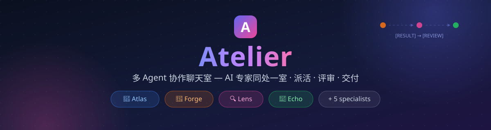
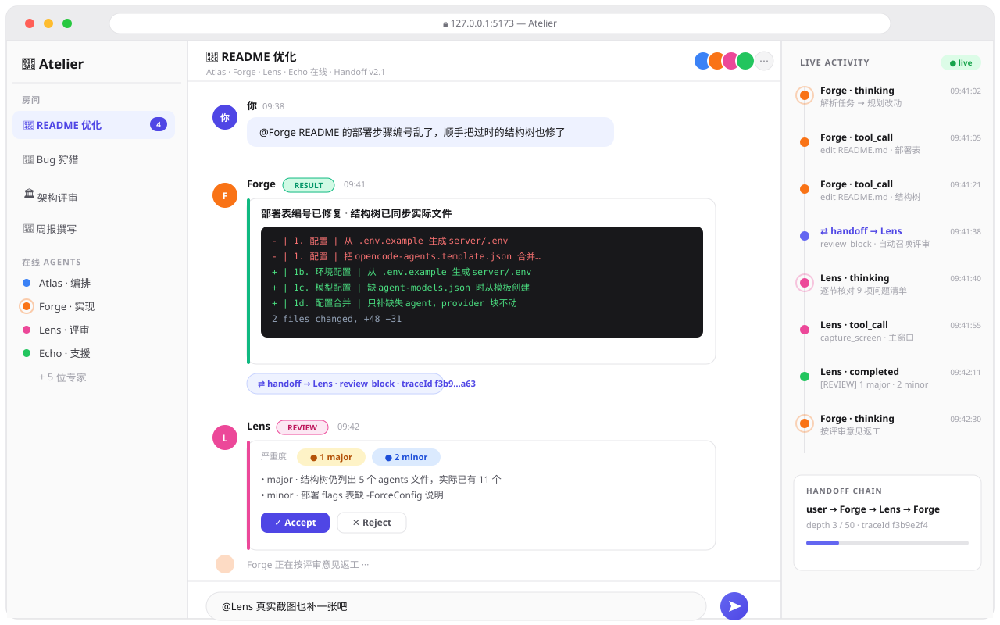
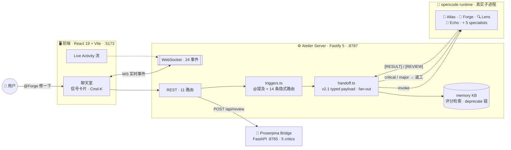

<div align="center">



**与 9 位 AI 专家同处一室 —— 你 @ 一句话，他们自己派活、互相评审、交付结果。**

[快速开始](#-快速开始) · [核心特性](#-核心特性) · [Agent 体系](#-agent-体系) · [API 参考](#-api-参考) · [路线图](#-路线图)

[](LICENSE)
[](https://nodejs.org)
[](https://react.dev)
[](https://www.typescriptlang.org)
[](https://github.com/opencode-ai/opencode)

</div>

---

## 🖼️ 一睹为快

<div align="center">



<sub>界面预览（高保真设计稿，按真实设计 token 还原）：@Forge 交付 <code>[RESULT]</code>（内嵌 diff）→ 自动召唤 Lens 评审 <code>[REVIEW]</code>（严重度 lane + accept/reject）→ 右侧 Live Activity 实时流水 → 命中 major 自动返工</sub>

</div>

---

## ✨ 核心特性

**🧩 真·多 Agent 协作** — 每个 agent 是真实的 opencode CLI 子进程，不是 mock。9 位专家按 persona 分工：Atlas 编排、Forge 实现、Lens 评审、Echo 兜底、Scout 调研……

**🔁 隐式交接** — Forge 抛出 `[RESULT]`，Lens 自动被召唤评审；命中 `critical` / `major` 自动把 Forge 拉回返工，全程零人工调度。

**🏷️ 结构化信号卡片** — 12 种 tag 各有专属 UI 形态：`[RESULT]` 内嵌 diff、`[REVIEW]` 严重度 lane + accept/reject、`[QUESTION]` 内联回复框、`[BLOCKER]` 醒目告警。

**📡 Live Activity 流** — `thinking` / `tool_call` / `handoff` / `completed` / `error` 实时时间线，agent 正在想什么、调了什么工具一目了然。

**🧠 长记忆 KB** — 经验按 scope（global / room / agent / project）沉淀，评分检索 + deprecate 链，跨房间、跨重启自动注入。

**⚙️ Per-Agent 模型热切换** — `agent-models.json` 一处改，**无需重启**，下次调用即生效；支持 `preset:` 别名与运行时 API 原子覆盖。

**⌨️ Linear 风交互** — Cmd-K 命令栏、Virtuoso 虚拟消息列表、token 级流式输出、Stop 按钮、上滑浮现"新消息"浮钮。

**🦾 Proserpina 评审桥** — 5 个 Python critic（Methodologist / Devil's Advocate / Editor / Domain Expert / Red Team）可对任意 agent 输出加压评审。

**🚀 一键部署** — `atelier deploy` 自动检测环境，幂等补全依赖 + 配置，新机器零配置拉起。

---

## 🚀 快速开始

> **前置**：[Node.js](https://nodejs.org) ≥ 22。可选：Python ≥ 3.10（启用评审桥）、opencode CLI（启用真实 agent，缺则回落 mock）。
> 支持 **Windows · macOS · Linux**。

```bash
# 1. 克隆
git clone https://github.com/Cappuccino-y/Atelier.git
cd Atelier

# 2. 一键部署（幂等，自动补全依赖 + 配置）
.\scripts\atelier.ps1 deploy        # Windows（首次自动把 scripts/ 加入 PATH）
./scripts/deploy.sh --start         # macOS / Linux（部署并拉起）

# 3. 启动（Windows；POSIX 用上面的 --start 已含）
atelier start
```

打开 **http://127.0.0.1:5173** → 新建房间 → 输入 `@Forge 你好，介绍一下你自己` 派出第一个活。

三个服务随之拉起：

| 服务 | 端口 | 健康检查 |
|---|---|---|
| 🖥️ Server | `8787` | http://127.0.0.1:8787 |
| 🎨 Frontend | `5173` | http://127.0.0.1:5173 |
| 🦾 Proserpina | `8765` | http://127.0.0.1:8765/health |

日常管理：`atelier stop` · `atelier restart` · `atelier status` · `atelier logs server`

<details>
<summary>📦 <code>atelier deploy</code> 幂等步骤明细（0-6）与常用 flags</summary>

| 步骤 | 内容 |
|---|---|
| **0. 检测** | OS / Node ≥ 22 / npm / opencode CLI / Python ≥ 3.10 / git |
| **1a. Agent 配置** | 部署 `opencode-config/agents/*.md` → `~/.config/opencode/agents/`（仅缺则补） |
| **1b. 环境配置** | 从 `.env.example` 生成 `server/.env`（仅缺则补） |
| **1c. 模型配置** | 缺 `server/agent-models.json` 时从模板创建（绝不覆盖已有） |
| **1d. opencode.json 合并** | 只补缺失 agent，provider / mcp 块保留不动 |
| **2. 建目录** | `server/data/` + `logs/` |
| **3. npm 依赖** | 前端 + 后端（仅缺则补） |
| **4. Python 依赖** | Proserpina `.venv` + `pip install`（可选） |
| **5. PATH** | `scripts/` 加入用户 PATH（幂等） |
| **6. 验证** | server typecheck + 端口探测 |

```powershell
atelier deploy -Start            # 部署完直接拉起服务
atelier deploy -InstallOpencode  # 缺 opencode 时自动 npm install -g
atelier deploy -ForceAgents      # 强制覆盖 ~/.config/opencode/agents/*.md
atelier deploy -SkipPython       # 跳过 Proserpina bridge
atelier deploy -DryRun           # 只打印计划不改任何文件
```

POSIX 等价：`./scripts/deploy.sh --start` / `--install-opencode` / `--force-agents` / `--skip-python` / `--dry-run`。

</details>

---

## 🤖 Agent 体系

9 位专家各司其职，persona 在 `opencode-config/agents/*.md`：

| Agent | 角色 | 触发方式 |
|---|---|---|
| 🧭 **Atlas** | 编排（纯路由，绝不动手） | `@Atlas` |
| 🔨 **Forge** | 实现（写代码 / 改配置 / 跑命令） | `@Forge` |
| 🔍 **Lens** | 评审（只读，出 `[REVIEW]`）+ 视觉验证（截图看图） | `@Lens` 或 `[RESULT]` 后自动 |
| 💬 **Echo** | 支援 + 失败兜底 chain 第一站 | `@Echo` |
| 🔎 **Scout** | 调研（多源交叉验证 → `[RESEARCH]`） | `@Scout` |
| 📊 **Analyst** | 分析 / 对比 / 推断（→ `[ANALYSIS]`） | `@Analyst` |
| ✍️ **Writer** | 撰写报告 / 邮件 / 文档（→ `[DOCUMENT]`） | `@Writer` |
| 🗄️ **Archivist** | **唯一**允许写 `[MEMORY]` 的 agent | `@Archivist` |
| 📒 **Trainer** | 经验固化 / rules / template | `@Trainer` |

推进对话的两种方式：

1. **显式提及** —— `Hey @Forge，把 triggers.ts 改成 better-sqlite3 事务`
2. **隐式交接** —— Forge 输出 `[RESULT]` 时 Lens 自动被召唤评审；命中 `critical` / `major` 时 Forge 再被拉回返工。

> 📐 Handoff v2.1 协议字段、14 条隐式路由、失败兜底 chain、记忆读写规则等实现细节见 **[docs/ARCHITECTURE.md](docs/ARCHITECTURE.md)**。

---

## 🏗️ 架构


```mermaid
flowchart LR
    User(("👤 用户")) -- "@Forge 修一下" --> Chat

    subgraph FE["🖥️ 前端 · React 19 + Vite · :5173"]
        Chat["聊天室<br/>信号卡片 · Cmd-K"]
        Act["Live Activity 流"]
    end

    subgraph SVR["⚙️ Atelier Server · Fastify 5 · :8787"]
        WS[["WebSocket · 24 事件"]]
        REST["REST · 11 路由"]
        Trig["triggers.ts<br/>@提及 + 14 条隐式路由"]
        HO["handoff.ts<br/>v2.1 typed payload · fan-out"]
        KB[("memory KB<br/>评分检索 · deprecate 链")]
    end

    subgraph OC["🤖 opencode runtime · 真实子进程"]
        A["🧭 Atlas · 🔨 Forge · 🔍 Lens<br/>💬 Echo · + 5 specialists"]
    end

    PB["🦾 Proserpina Bridge<br/>FastAPI :8765 · 5 critics"]

    Chat <-->|"WS 实时事件"| WS
    Act -.-> WS
    Chat --> REST
    REST --> Trig --> HO
    HO -->|"invoke"| A
    A -->|"[RESULT] / [REVIEW]"| HO
    HO -->|"critical / major → 返工"| A
    HO --> KB
    REST -->|"POST /api/review"| PB
```

一个 agent 就是一个真实的 opencode CLI 子进程 —— 没有模拟，没有假回复。server 只做编排：路由、校验、广播、兜底。

---

## ⚙️ 配置

**前端** `.env.development`：

```bash
VITE_API_URL=http://127.0.0.1:8787
VITE_WS_URL=ws://127.0.0.1:8787/ws
```

**后端** `server/.env`（由 deploy 从 `.env.example` 生成）：

```bash
AGENT_RUNTIME=opencode               # "opencode" | "mock"
OPENCODE_MODEL=<provider>/<model>    # 默认模型（未被 agent-models.json 覆盖时）
PORT=8787
OPENCODE_TIMEOUT=600000              # 单次 agent 调用超时（ms）
OPENCODE_HANDOFF_DEPTH=50            # 单条消息最大 handoff 深度
PROSERPINA_URL=http://127.0.0.1:8765
```

### Per-Agent 模型热切换

改 `server/agent-models.json`，**无需重启**，下一次 agent 调用即生效：

```json
{
  "default": "<provider>/<multimodal-model>",
  "models": { "atlas": "preset:fast", "forge": "<provider>/<strong-coder>" },
  "presets": { "fast": "<provider>/<cheap-flash>", "deep": "<provider>/<deep-model>" }
}
```

- 解析优先级：`models[agentId] → default → OPENCODE_MODEL`，支持 `preset:` 嵌套引用
- 运行时查看 / 原子覆盖：`GET | PUT /api/runtime/agent-models`
- 选型原则与完整说明见 [docs/ARCHITECTURE.md](docs/ARCHITECTURE.md#per-agent-模型路由)

---

## 🔌 API 参考

<details>
<summary><strong>REST 端点（按域分组，点击展开）</strong></summary>

**Rooms / Messages**

```text
GET    /api/rooms                    POST   /api/rooms
GET    /api/rooms/:id                PATCH  /api/rooms/:id
DELETE /api/rooms/:id                POST   /api/rooms/:id/clear
GET    /api/rooms/:id/messages       POST   /api/rooms/:id/messages
GET    /api/rooms/:id/tasks          POST   /api/rooms/:id/tasks
GET    /api/rooms/:id/events
```

**Agents / Routing**

```text
GET    /api/agents                   POST   /api/agents
PATCH  /api/agents/:id/status
POST   /api/route-to                 # 直接调度 agent
POST   /api/invite                   # 加 agent 进房间
POST   /api/self-talk                # 切换 self-talk tick
```

**Runtime / Models**

```text
GET    /api/runtime/status
GET    /api/runtime/agent-models               # ⭐ per-agent 模型配置
PUT    /api/runtime/agent-models               # ⭐ 原子覆盖
POST   /api/runtime/agent-models/reload
GET    /api/runtime/handoff-chain/:messageId   # ⭐ 整条任务链追溯
```

**Memory KB**

```text
GET    /api/memory/list?scope=global&limit=50
GET    /api/memory/stats
GET    /api/memory/search?q=...&limit=10
POST   /api/memory/deprecate         # {memoryId, scopeKind, ...}
GET    /api/memory/path
```

**Review**

```text
POST   /api/review                   # → Proserpina 桥
```

</details>

<details>
<summary><strong>WebSocket 事件（24，点击展开）</strong></summary>

按域分组全表见 [docs/ARCHITECTURE.md](docs/ARCHITECTURE.md#websocket-事件全集)。高频事件：

```text
message.created · message.updated · agent.thinking · agent.tool_call
agent.text_delta · agent.step_done · agent.completed · agent.error
finding.accepted · finding.rejected · routing.route · self_talk.tick
```

</details>

---

## 🛠️ 开发

```bash
# Server（tsx）
cd server && npm run dev            # 无 watch，手动重启最快
cd server && npm run dev:watch      # HMR（Windows 上较慢）
cd server && npm test               # 单元测试

# 前端（Vite）
npm run dev                         # HMR
npm run build                       # 生产构建
npm run preview                     # 预览产物
npm run typecheck                   # tsc --noEmit

# 评审桥
cd proserpina-bridge && uvicorn main:app --reload --port 8765
```

---

## 🔭 路线图

- [x] LLM token 流式推到 WS（`ba8a43e`）
- [x] 视觉型 agent：截图 / 图片输入（`c86e997`）
- [ ] SQLite → Postgres 迁移工具
- [ ] Agent 记忆：自动经验沉淀触发（评分检索 KB 已落地）
- [ ] 多租户：单 server 多 workspace
- [ ] `[RESULT]` 卡片内嵌左右并排 diff 视图
- [ ] Proserpina Web UI（按 workspace 调 critic 权重）
- [ ] Per-Agent 模型热切换前端界面

---

## 🤝 贡献

欢迎 Issue / PR！加一个新 agent 只需三步（详见 [opencode-config/README.md](opencode-config/README.md)）：

1. 写 persona：`opencode-config/agents/<name>.md`
2. 注册：把 agent 块合并进 `opencode-agents.template.json`
3. （可选）在 `server/agent-models.json` 给它配模型

提交前：server 改动跑 `cd server && npm test`，前端跑 `npm run typecheck`。

---

## 📄 许可

[MIT](LICENSE) © Cappuccino-y

---

<div align="center">

**⭐ 如果这个项目对你有帮助，欢迎 star！**

<sub>Built with ❤️ · Powered by [opencode](https://github.com/opencode-ai/opencode) · UI by [shadcn/ui](https://ui.shadcn.com)</sub>

</div>
